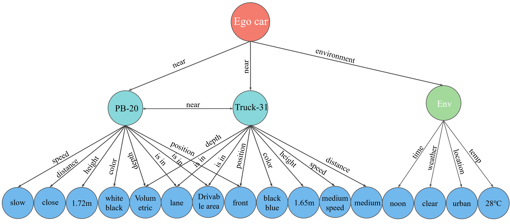
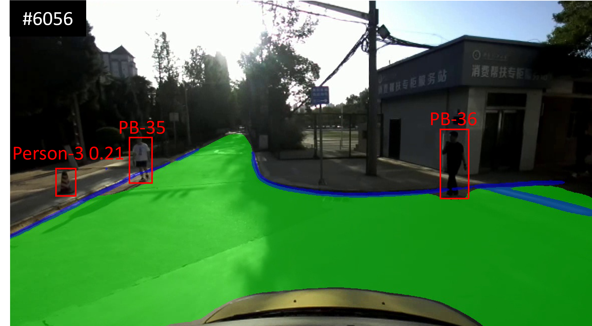
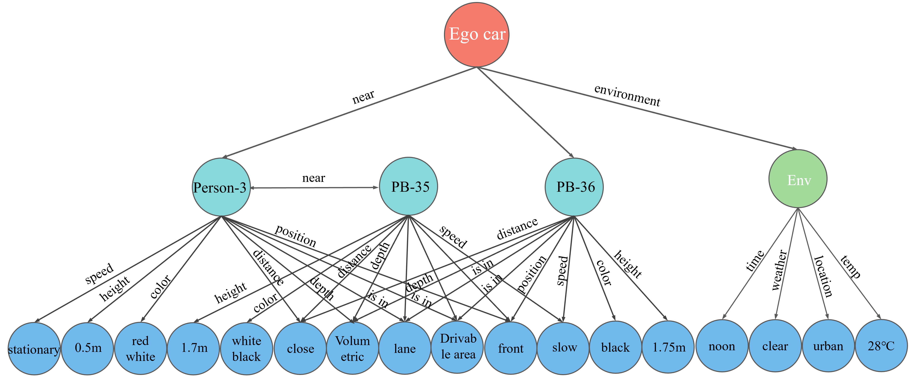
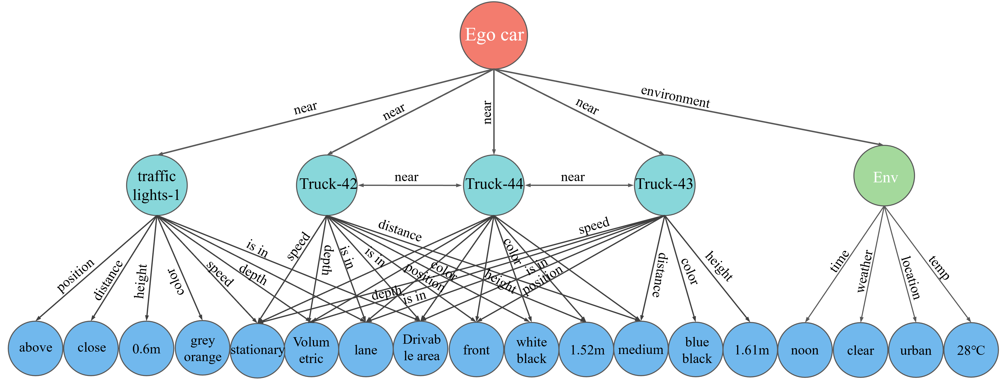

# Human‑inspired Online Correction of Object Misrecognition for Autonomous Driving Systems  
**Official Implementation**

---

## 📖 Introduction  
This repository is the official implementation of the paper  
> “Human‑inspired Online Correction of Object Misrecognition for Autonomous Driving Systems.”  
It provides all the code, data preprocessing scripts, and example outputs needed to reproduce and extend the experiments described in the paper.
---

CTDC model diagram：
<p align="center">
  
</p>


## 🚀 Key Contributions

1. **Human‑like Closed‑Loop Dual‑System Cognitive Model**  
   -Inspired by the human dual-system cognitive architecture, we constructed a human-like closed-loop triggered dual-system cognitive model to address misrecognition issues in the environmental perception phase of autonomous driving.
   -This model not only replicates the cognitive characteristics of both human intuitive and analytical thinking but also integrates a triggering mechanism and a learning module inspired by analytical reasoning. These components enable dynamic and context-aware intervention when object misrecognition occurs

3. **TRG‑Trust Model**  
   - To address the lack of semantic judgment methods in object recognition and the limited accuracy of traditional triplet confidence recognition, we improved the KGTtm algorithm based on the HG-GRU model and proposed the TRG-Trust model.
   -  The TRG-Trust model not only effectively identifies misrecognition through triplet confidence methods but also outperforms the KGTtm model in both accuracy and recall;

4. **DCM‑RAG Model**  
   - To address the issues of insufficient accuracy and potential hallucinations when relying solely on LLMs or traditional RAG reasoning, we developed the Dual-Constraint Multimodal Retrieval-Augmented Generation Model (DCM-RAG) based on KGs.
   - The DCM-RAG model constrains the relevance of retrieved documents through a dual-constraint method and combines multimodal data (image and semantic features) as input to LLMs, effectively improving accuracy and reducing hallucination phenomena.

```bash
## 🛠️ Requirements

- **Python** ≥ 3.8 (we use 3.9)  
- **PyTorch** ≥ 1.2 (we use 2.2.1 + CUDA 12.1)  
- **torchvision** ≥ 0.4 (we use 0.17.1)  
- **torchaudio** ≥ 1.2 (we use 2.2.1)  
- **tqdm**  
- **h5py**  
- **urllib3**
```

CTDC/
├── main.py            # Entry point for the TRG‑Trust model, including HG‑GRU construction
├── data/              # ADTKG dataset preprocessing scripts and intermediate files
├── example/           # Visualization outputs for CTDC experiments
│   ├── SGG/           # Scene graph examples
│   └── TRG‑Trust/     # Inference results of the TRG‑Trust model
└── README.md          # This file

The misidentification phenomenon is simulated by artificially modifying the target category labels to more realistically evaluate the performance of the CTDC model in dealing with such problems. For example, in the experiment, the "Person" category label is deliberately changed to the wrong category "PB (Portrait in billboard)"; the "Road Reflector (RCM)" label is changed to "Traffic light", "Car" is changed to "Truck", and "Traffic Cone" is changed to "Person".
Example:
<p align="center">
  
  
  
</p>
<p align="center">
  
  
  
</p>
<p align="center">
  
  
  
</p>

If you find our paper and code useful for your research, please consider giving a Star ⭐ and a Citation 📝 :
# CITATION.cff
cff-version: 1.2.0
message: "If you use this code, please cite our unpublished manuscript."
title: "Human‑inspired Online Correction of Object Misrecognition for Autonomous Driving Systems"
authors:
  - family-names: Zhou
    given-names: Jincao
  - family-names: Ning
    given-names: Benyu
  - family-names: Fu
    given-names: Weiping
  - family-names: Rui
    given-names: Hongbin
  - family-names: Li
    given-names: Shen
    affiliation: Member, IEEE
  - family-names: Ran
    given-names: Bin
  - family-names: Hao
    given-names: Longyun
  - family-names: Li
    given-names: Rui
version: 0.1.0
date-released: 2025-05-17
url: "https://github.com/PlutoXN/CTDC"

